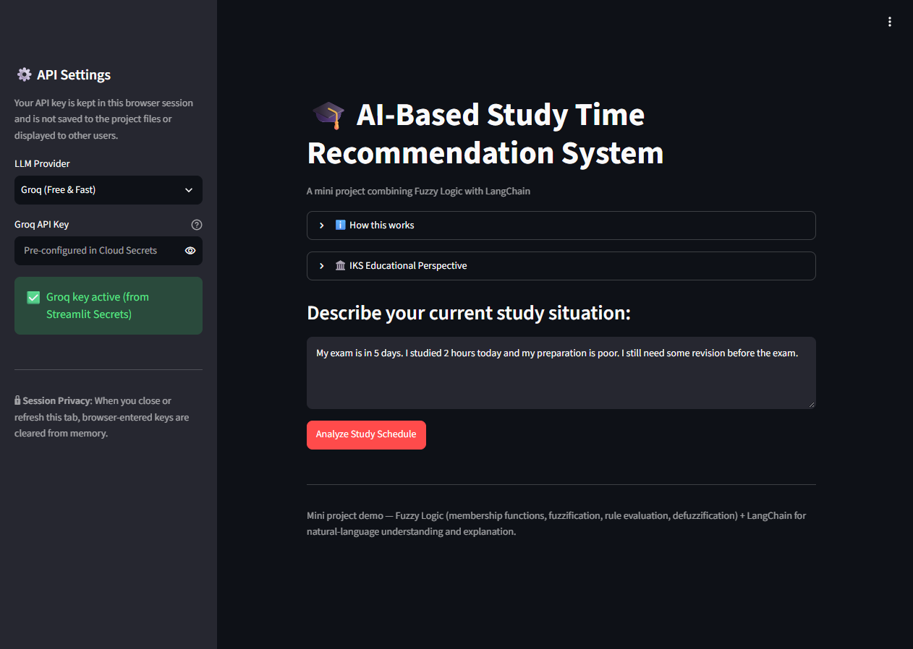
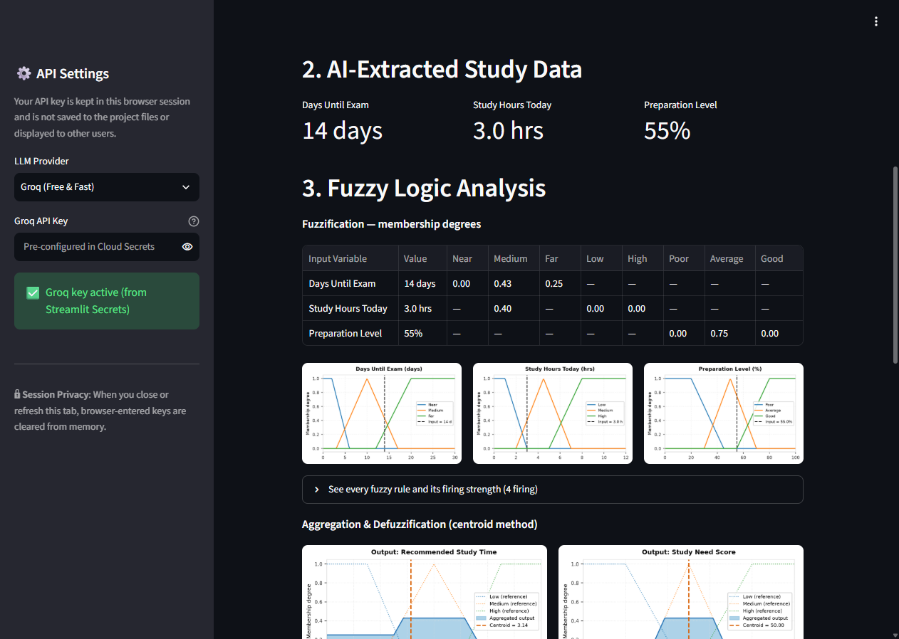
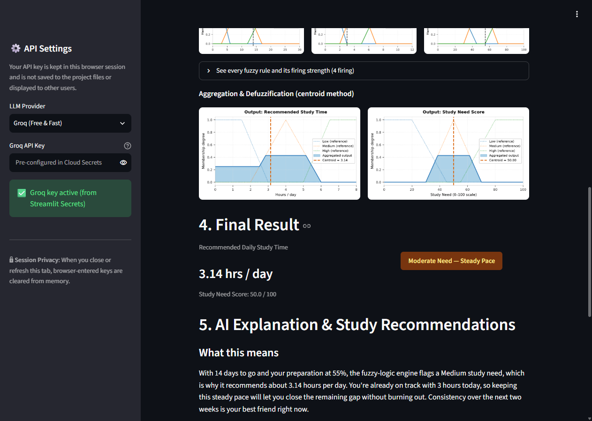
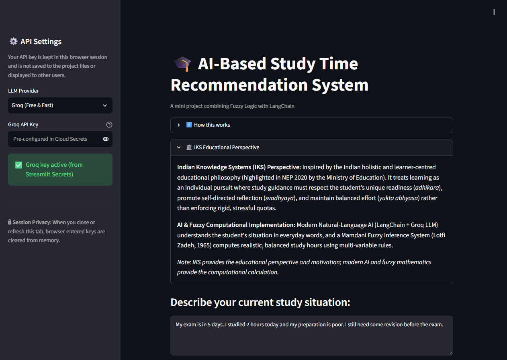

# AI-Based Student Study Time Recommendation System Using Fuzzy Logic

**Third Year B.Sc. Information Technology (B.Sc. IT) — Semester VI**  
**Individual IKS Project (Indian Knowledge Systems)**

---

## Project Description

The **AI-Based Student Study Time Recommendation System Using Fuzzy Logic** is an intelligent academic advisory web application designed to help students optimize their daily revision schedule before examinations. Students describe their situation in everyday conversational English, which a Large Language Model (LangChain + Groq API) extracts into structured, validated parameters. A transparent 18-rule Mamdani Fuzzy Inference System then evaluates these multi-variable conditions using centroid defuzzification to calculate realistic daily study hours and an urgency score. Finally, an AI academic coach translates the numerical result into supportive explanations and actionable study tips.

---

## Main Features

* **Natural-Language Student Input:** Accepts everyday conversational sentences describing upcoming exams, study hours, and confidence.
* **Structured Parameter Extraction:** Leverages LangChain with the Groq LLM (`qwen/qwen3.8-27b`) for zero-shot natural language understanding.
* **Pydantic Schema Validation:** Enforces strict bounds on days remaining (0–30), hours studied today (0–12), and preparation percentage (0–100%).
* **First-Principles Mamdani Fuzzy Engine:** Pure-Python implementation (NumPy) featuring triangular/trapezoidal membership functions, min/max implication, and centroid defuzzification.
* **Complete 18-Rule Base:** Comprehensive multi-variable rules guaranteeing zero orphan states across all valid inputs.
* **AI Explanation & Coaching Tips:** Generates an encouraging explanation paragraph alongside 5 structured, high-impact study recommendations.
* **Indian Knowledge Systems (IKS) Framing:** Aligns study recommendations with traditional Indian pedagogical concepts of learner readiness (*Adhikara-Bheda*), self-directed reflection (*Svadhyaya*), and balanced effort (*Yukta Abhyasa*).
* **Interactive Visualizations:** Renders real-time Matplotlib plots of fuzzified membership curves and aggregated defuzzification areas.
* **Clean Streamlit UI:** Responsive web dashboard with color-coded urgency status pills (Green/Amber/Red) and per-session API key privacy.

---

## Technologies Used

| Category | Technology | Usage in Project |
| :--- | :--- | :--- |
| **Language** | Python 3.11+ / 3.14 | Core backend scripting, fuzzy logic mathematics, and testing |
| **User Interface** | Streamlit | Responsive web dashboard and reactive state management |
| **LLM Framework** | LangChain (`langchain`, `langchain-core`) | Prompt templating and structured LLM output orchestration |
| **LLM Provider** | Groq API (`langchain-groq`) | Fast cloud LLM inference (`qwen/qwen3.8-27b`) |
| **Data Validation**| Pydantic V2 | Strict type and numerical bounds enforcement |
| **Mathematics** | NumPy | Matrix operations, membership evaluation, and centroid integration |
| **Visualizations** | Matplotlib | Input membership function and defuzzified output plots |
| **Testing** | Pytest | 29-test automated unit suite covering rule firing and boundary math |

---

## Project Structure

```text
student-study-fuzzy-ai/
├── app.py                     # Streamlit web dashboard & UI presentation
├── extractor.py               # LangChain chain 1: NLU parameter extraction
├── explainer.py               # LangChain chain 2: AI advice & study tips
├── fuzzy_system.py            # Pure-Python Mamdani Fuzzy Inference System
├── llm_config.py              # 3-tier credentials resolver (Session/Secrets/Env)
├── models.py                  # Pydantic schemas & validation models
├── visualization.py           # Matplotlib membership & centroid charts
├── requirements.txt           # Project dependencies
├── docs/                      # Academic documentation & screenshots
│   ├── iks_connection.md     # Detailed IKS educational perspective analysis
│   ├── iks_sources.md        # Official verified source records (NEP 2020, etc.)
│   └── screenshots/          # High-resolution live application screenshots
└── tests/
    └── test_fuzzy.py          # 29 automated unit tests (Pytest)
```

---

## Setup & Installation

1. **Clone the repository:**
   ```bash
   git clone https://github.com/yash26761/student-study-fuzzy-ai.git
   cd student-study-fuzzy-ai
   ```

2. **Create and activate a virtual environment:**
   * On Windows:
     ```bash
     python -m venv venv
     venv\Scripts\activate
     ```
   * On Linux/macOS:
     ```bash
     python3 -m venv venv
     source venv/bin/activate
     ```

3. **Install dependencies:**
   ```bash
   pip install -r requirements.txt
   ```

4. **Configure API Key:**
   Copy `.env.example` to `.env` and provide your free Groq API key:
   ```env
   GROQ_API_KEY=your_groq_api_key_here
   ```
   *(Alternatively, enter your key directly into the application sidebar when running).*

---

## Run the Project

Launch the Streamlit web application locally:
```bash
streamlit run app.py
```
Open [http://localhost:8501](http://localhost:8501) in your browser.

To run the automated test suite:
```bash
python -m pytest tests/ -v
```

---

## How to Use

1. **Open the Web Dashboard:** Access the live app or your local instance.
2. **Describe Your Situation:** Enter your study situation in natural language (e.g., *"I have 14 days until my exam, I can study 3 hours daily, and my preparation is around 55 percent."*).
3. **Click Analyze:** The LangChain pipeline extracts and validates `days_until_exam`, `study_hours`, and `preparation_level`.
4. **Inspect Fuzzy Evaluation:** Review fuzzified membership degrees, active fuzzy rules, and defuzzification curves.
5. **Review Recommendations:** Check the recommended daily study hours and color-coded urgency status badge.
6. **Read AI Coaching Advice:** Review the generated explanation and 5 categorized study strategies.
7. **Explore IKS Perspective:** Expand the **🏛️ IKS Educational Perspective** tab to see how holistic Indian pedagogy motivates personalized learning.

---

## Screenshots

| 1. Main User Interface & Input | 2. AI-Extracted Parameters & Fuzzy Plots |
| :---: | :---: |
|  |  |

| 3. Final Recommendation & AI Tips | 4. IKS Educational Perspective |
| :---: | :---: |
|  |  |

---

## Live Deployment

* **Live Web Application:** [https://student-study-fuzzy-ai.streamlit.app/](https://student-study-fuzzy-ai.streamlit.app/)
* **GitHub Repository:** [https://github.com/yash26761/student-study-fuzzy-ai](https://github.com/yash26761/student-study-fuzzy-ai)

---

## Student Details

* **Student Name:** Yash Sanjay Haldankar
* **Roll Number:** 19016
* **Course:** Third Year B.Sc. Information Technology (T.Y. B.Sc. IT — Semester VI)
* **Academic Year:** 2025 – 2026
* **Curricular Component:** Individual IKS Project (Indian Knowledge Systems)

---

## IKS Connection

In alignment with the **National Education Policy 2020 (NEP 2020)** and the **IKS Division (Ministry of Education, Govt. of India)**, this project connects academic scheduling with the traditional Indian holistic, learner-centred educational philosophy. Rather than imposing rigid, stressful quotas, the system honors **learner readiness (*Adhikara-Bheda*)**, encourages **self-directed reflection (*Svadhyaya*)**, and promotes **balanced daily effort (*Yukta Abhyasa*)** to prevent academic burnout. *Note: IKS provides the educational perspective and motivation; modern AI and fuzzy mathematics (Lotfi Zadeh, 1965) provide the computational execution.*
